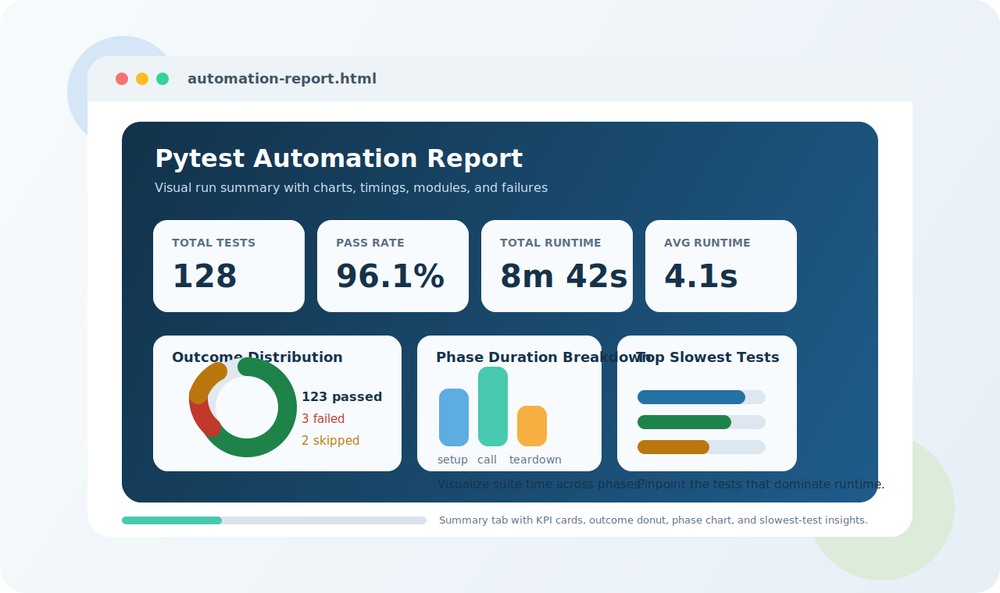
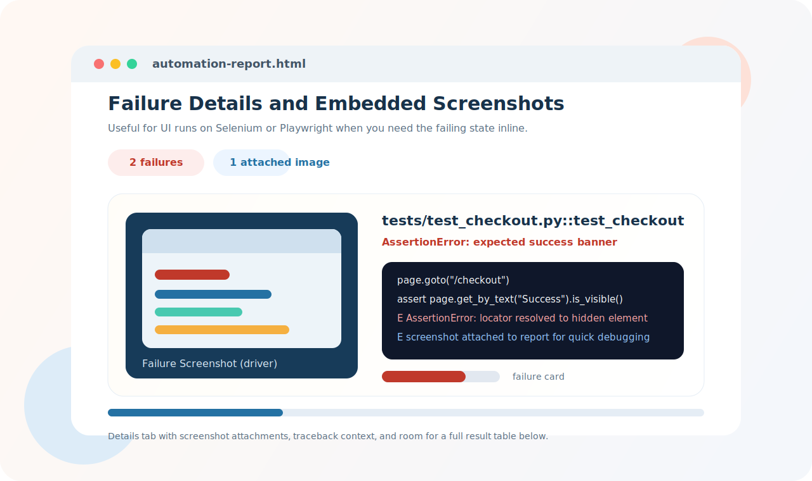

# pytest-automation-report

`pytest-automation-report` is a lightweight pytest plugin that creates a self-contained HTML execution report after a test run. It works with plain pytest suites as well as UI suites built on Selenium or Playwright. The report includes:

- summary cards for key test metrics
- outcome distribution charts
- execution phase timing charts
- slowest test visualizations
- module-level execution breakdown
- embedded failure screenshots
- failure details and a complete test result table

## Preview

### Dashboard summary



### Failure details with screenshots



## Installation

```bash
pip install -e .
```

## Usage

Generate a report on demand:

```bash
pytest --automation-report=reports/automation-report.html
```

Customize the report title:

```bash
pytest \
  --automation-report=reports/automation-report.html \
  --automation-report-title="Nightly Regression Dashboard"
```

You can also configure a default output path in `pytest.ini`:

```ini
[pytest]
automation_report = reports/automation-report.html
automation_report_title = CI Automation Report
```

## What the Report Includes

- KPI summary cards for total tests, pass rate, total runtime, and average runtime
- a donut chart showing overall test outcomes
- a bar chart for total phase durations across setup, call, and teardown
- a bar chart for the slowest tests in the run
- a bar chart highlighting the busiest test modules
- embedded screenshots for failed UI tests
- failure cards with stack traces
- a detailed test results table

## Example Integration

Once installed, the plugin is discovered automatically by pytest through the `pytest11` entry point. That means your existing test suite can use it without changing test code.

If you prefer local plugin loading during development, you can also enable it explicitly:

```python
# conftest.py
pytest_plugins = ["pytest_automation_report.plugin"]
```

## UI Screenshot Support

The plugin supports screenshots in two ways:

- automatic capture on test failure from supported Selenium and Playwright fixtures
- manual screenshot attachment from the test itself through the `automation_report` fixture

### Automatic failure screenshots

Selenium WebDriver fixtures named `driver`, `browser`, `selenium`, or `webdriver` are detected automatically when they expose `get_screenshot_as_base64()` or `get_screenshot_as_png()`.

If your test already uses a Selenium fixture called `driver`, no extra code is required beyond generating the report:

```python
def test_checkout(driver):
    driver.get("https://example.com/checkout")
    assert "Success" in driver.page_source
```

When that test fails during the call phase, the plugin will try to capture a screenshot and embed it directly in the HTML report.

Playwright sync fixtures named `page`, `playwright_page`, `context`, or `browser_context` are also supported. For context fixtures, the plugin captures the most recently opened page.

```python
def test_checkout(page):
    page.goto("https://example.com/checkout")
    assert page.get_by_text("Success").is_visible()
```

When that test fails during the call phase, the plugin will call `page.screenshot(type="png")` and embed the image into the report.

### Manual screenshot attachment

Use the built-in `automation_report` fixture when you want explicit control over what gets attached:

```python
def test_checkout(driver, automation_report):
    driver.get("https://example.com/checkout")

    if "Success" not in driver.page_source:
        automation_report(
            image_base64=driver.get_screenshot_as_base64(),
            name="Checkout failure state",
        )

    assert "Success" in driver.page_source
```

You can also attach raw bytes:

```python
automation_report(image_bytes=driver.get_screenshot_as_png(), name="Current page")
```

The same manual helper works with Playwright:

```python
def test_checkout(page, automation_report):
    page.goto("https://example.com/checkout")
    automation_report(image_bytes=page.screenshot(type="png"), name="Checkout state")
    assert page.get_by_text("Success").is_visible()
```

### Helper import option

If you prefer not to use the fixture, you can also call the helper directly:

```python
from pytest_automation_report.plugin import attach_screenshot


def test_checkout(driver, request):
    attach_screenshot(
        request,
        image_base64=driver.get_screenshot_as_base64(),
        name="Checkout failure state",
    )
```
